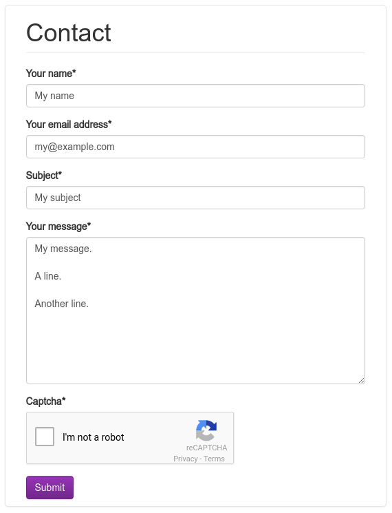

.. -*-restructuredtext-*-

django-contact-form-recaptcha
=============================

.. image:: https://travis-ci.org/maru/django-contact-form-recaptcha.svg
    :target: https://travis-ci.org/maru/django-contact-form-recaptcha
.. image:: https://readthedocs.org/projects/django-contact-form-recaptcha/badge/?version=latest
    :target: http://django-contact-form-recaptcha.readthedocs.io/en/latest/?badge=latest
    :alt: Documentation Status

This application provides simple, extensible contact-form functionality
for `Django <https://www.djangoproject.com/>`_ sites.

*  Mail header 'From: "Your Name" <your@email.com>', so it's easy to reply to the sender.

*  Subject provided by the user.

*  Uses `reCAPTCHA <https://www.google.com/recaptcha>`_ to block spam robots.

*  Templates using Twitter Bootstrap version 3.

Quick start
-----------

Requirements:

- Python (2.7, 3.4, 3.5, 3.6)
- Django (1.11, 2.0)

To use the `contact_forms.forms.ReCaptchaContactForm` form:

1. Install django-contact-form-recaptcha::

    pip install django-contact-form-recaptcha

2. Obtain the reCAPTCHA API keys from https://www.google.com/recaptcha.

3. Supply the API keys for django-contact-form-recaptcha to use. You can
   either place them in the Django settings ``RECAPTCHA_PUBLIC_KEY``
   and ``RECAPTCHA_PRIVATE_KEY``, or in the environment variables
   ``PYTHON_RECAPTCHA_PUBLIC_KEY`` and ``PYTHON_RECAPTCHA_PRIVATE_KEY``.

   Then use the following URLconf:

   .. code-block:: python

      from django.conf.urls import include, url

      urlpatterns = [
          # ... other URL patterns for your site ...
          url(r'^contact/', include('contact_form.recaptcha_urls')),
      ]

   If you're using Django 2.0, you can do:

   .. code-block:: python

      from django.conf.urls import include, path

      urlpatterns = [
          # ... other URL patterns for your site ...
          url(r'^contact/', include('contact_form.recaptcha_urls')),
      ]

4. Use the default templates or create your owns.

Full documentation for all functionality is included and is also
`available online <http://django-contact-form-recaptcha.readthedocs.io/>`_.

Originally forked from `django-contact-form <https://github.com/ubernostrum/django-contact-form>`_.
